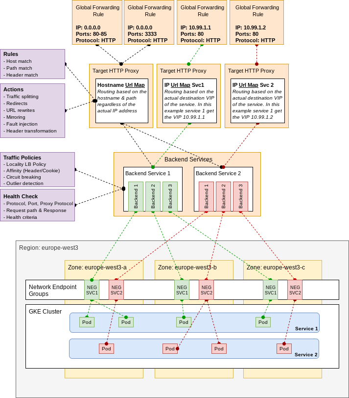

# Deploy a private GKE with Traffic Director integration

## Description
Source files for the deployment of a GKE Cluster with 3 services which communicate with each other via the Traffic Director.

The network, Firewall rules, cluster and Traffic Director are deployed via gcloud (shell script).

The K8s deployments, services, ingress and L7 ILB are all via K8s resource manifest files.

This demo implementation is based on: https://cloud.google.com/traffic-director/docs/set-up-gke-pods


## How Traffic Director works
The diagram below shows how the TD components "Global forwarding rule", "Target HTTP Proxy" and "Backend Services" work together with Network Enpoint groups and Kubernetes deployments in regional GKE clusters:



## Demo Architecture
The diagram below shows the architecture we build in this demo:
...

## Install instructions
### Set up networking, GKE clusters and build containers
* Open the command line, make sure gcloud is installed and authenticate yourself with gcloud auth login
* Create a project env var and set it to your project id
    ```
    PROJECT_ID=[your prj id]
    ```
* Run the following script
    ```
    ./install.sh -p $PROJECT_ID
    ```
    This should take about 5-10 minutes to create.
* Before we start deploying the services to the clusters, first fetch the cluster config into env vars:
    ```
    gcloud container clusters get-credentials td-cluster-w3 --region europe-west3 --project $PROJECT_ID
    WEST3=`kubectl config current-context`
    gcloud container clusters get-credentials td-cluster-w4 --region europe-west4 --project $PROJECT_ID
    WEST4=`kubectl config current-context`
    ```


### Deploy the micro services
* Now we can deploy the microservices in our 2 regional GKE cluster
    ```
    kubectl apply -f k8s/app1.yaml --cluster $WEST3
    kubectl apply -f k8s/app2.yaml --cluster $WEST3
    kubectl apply -f k8s/app3.yaml --cluster $WEST3
    kubectl apply -f k8s/app1.yaml --cluster $WEST4
    kubectl apply -f k8s/app2.yaml --cluster $WEST4
    kubectl apply -f k8s/app3.yaml --cluster $WEST4
    ```
* This will install the services 1, 2 & 3 on both GKE clusters. The deployment for each service has 3 replicas, which will be spread over 3 different zones.
* Each pod consists of a container running the code + a sidecar container used as proxy for all communication with the pod.
* The neg annotation in the service manifest triggers the creation of Network endpoint groups on GCP. These NEGs are directly connected to the pods and will be used by Traffic Director. 
* Service1 communicates with service2 and service2 with service3


### Deploy the Traffic Director
* Now that we have our pods & services up and running we can continue with configuring the traffic director:
    ```
    ./create-td.sh -p [PROJECT_ID]
    ```
* This creates all resources needed for TD. Have a look at the **create-td.sh** file to learn how it works.


## Testing the deployment
We will test our application in multiple ways. Let's start simple by testing if the L7 routing works:

### Test L7 routing
* For this we deploy a new pod who is running "Busybox" + an xDS API-compatible sidecare proxy (Istio/Envoy) in one cluster:
    ```
    kubectl apply -f k8s/td_client.yaml --cluster=$WEST3
    
    # Get name of busybox pod
    BUSYBOX_POD=$(kubectl get po -n td -l run=client -o=jsonpath='{.items[0].metadata.name}')

    # Command to execute that tests connectivity to the service service-test.
    TEST_CMD="wget -q -O - service1; echo"

    # Execute the test command on the pod.
    kubectl exec -it $BUSYBOX_POD -n td -c busybox -- /bin/sh -c "$TEST_CMD"
    ```

## Fast install
```
./install.sh -p hewagner-demos-2
kubectl apply -f app11.yaml
kubectl apply -f app22.yaml
kubectl apply -f app33.yaml
kubectl apply -f td_client.yaml
sleep 10
./create-td2.sh -p hewagner-demos-2
sleep 20
gcloud container clusters get-credentials td-cluster --region europe-west3
CLU1=`kubectl config current-context`
kubectl exec -it $(kubectl get po -n td -l run=client -o=jsonpath='{.items[0].metadata.name}' --cluster=$CLU1) --cluster=$CLU1 -n td -c busybox -- /bin/sh -c 'wget -q -O - service11'; echo
```

## Error handling
If anything goes wrong ...
* make sure that all pre-requisites are full-filled: https://cloud.google.com/traffic-director/docs/setting-up-traffic-director
* Use the official docu to go through step by step: https://cloud.google.com/traffic-director/docs/set-up-gke-pods


## Clean Up
./create-td.sh -p hewagner-demos-2 -d
kubectl delete svc service1 service2 service3 -n td
kubectl delete deployment app10 app20 app30 client -n td
./install.sh -p hewagner-demos-2 -d


